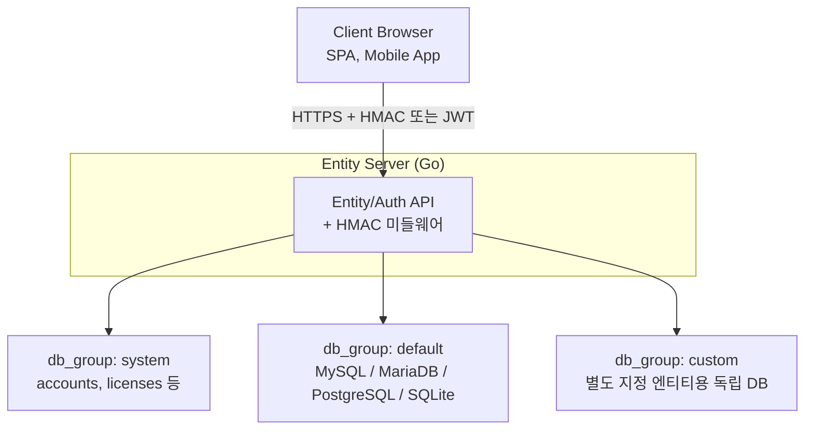
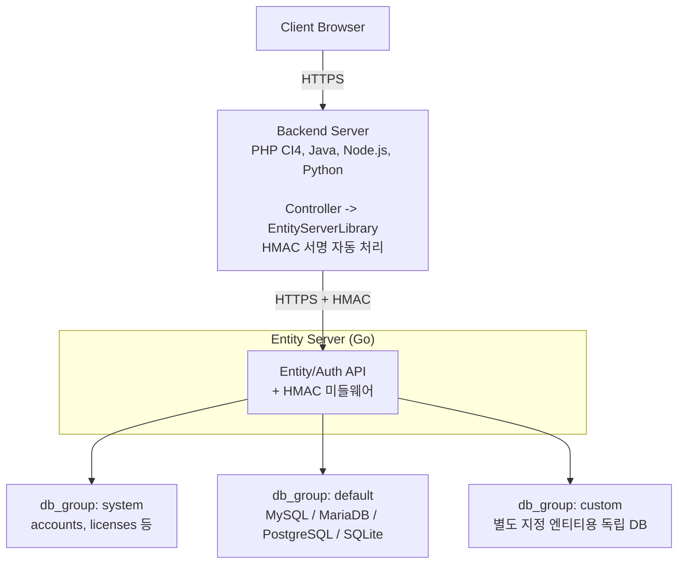
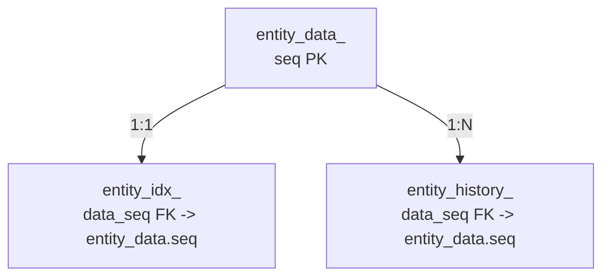

# Architecture — 배포/운영용

## 시스템 구성

### 패턴 A — 클라이언트 직접 연결

브라우저(또는 모바일 앱)가 Entity Server에 HMAC 또는 JWT로 직접 접속하는 구조입니다.  
Admin Web 등 SPA 환경에서 주로 사용합니다.



### 패턴 B — 백엔드 서버 경유

기존 백엔드(PHP/CI4, Java, Node.js 등)가 브라우저 요청을 받아  
Entity Server 라이브러리를 통해 Entity Server와 HMAC으로 통신하는 구조입니다.  
백엔드가 비즈니스 로직·인증을 담당하고, 데이터 저장/조회만 Entity Server에 위임합니다.



> CI4 예시: 컨트롤러에서 `$this->entityServer->get('account', $seq)` 형태로 호출하면  
> 라이브러리가 HMAC 서명을 붙여 Entity Server API를 호출하고 결과를 반환합니다.

## 데이터 모델

엔티티 하나당 세 개의 테이블이 자동 생성됩니다.

| 테이블 패턴             | 주요 컬럼                                           | 역할                | 비고                              |
| ----------------------- | --------------------------------------------------- | ------------------- | --------------------------------- |
| `entity_data_<name>`    | `seq`, `data`(blob), `created_time`, `deleted_time` | 암호화 본문 저장소  | AES-128-CTR JSON                  |
| `entity_idx_<name>`     | `data_seq`(FK), 엔티티 `index` 설정 필드들          | 검색·정렬·JOIN 전용 | `sync-index`로 스키마 무중단 반영 |
| `entity_history_<name>` | `seq`, `data_seq`(FK), `data_snapshot`, `action`    | 변경 이력 스냅샷    | `history_ttl`로 자동 정리         |

**테이블 관계**



## db_group — 엔티티별 DB 라우팅

엔티티 설정 JSON의 `db_group` 값으로 저장 대상 DB를 지정합니다.

| db_group 값  | 연결 대상 (`configs/database.json`)       |
| ------------ | ----------------------------------------- |
| (미지정)     | `default` 커넥션                          |
| `"system"`   | `system` 커넥션 (users, licenses 등 내장) |
| `"custom_x"` | `custom_x` 커넥션 (직접 정의)             |

## 운영 CLI 흐름

> 모든 스크립트는 `scripts/` 디렉토리에 위치하며, `bin/entity-cli` 바이너리를 내부적으로 호출합니다.  
> `--apply` / `--force` 없이 실행하면 dry-run으로 변경 예정 내용만 출력합니다.

### 초기 설치 / 장애 복구

```bash
# 미리보기 (dry-run)
scripts/reset-all.sh --dry-run

# 전체 엔티티 테이블 재생성 + 기본 데이터 시드 (확인 프롬프트 있음)
scripts/reset-all.sh --apply

# 확인 프롬프트 없이 즉시 실행 (위험!)
scripts/reset-all.sh --force
```

### 스키마 변경 배포

```bash
# 엔티티 JSON index 수정 후
scripts/sync.sh --all --apply          # 전체 엔티티 인덱스 컬럼 추가/변경
scripts/sync.sh --all --apply --with-data  # 기존 데이터 백필 포함
scripts/sync.sh <name> --apply         # 특정 엔티티만
scripts/sync.sh <name>                 # dry-run (변경 예정 내역만 출력)
```

### 이력 정리 배치

```bash
# history_ttl 기준으로 만료 이력 삭제
scripts/cleanup-history.sh --apply
scripts/cleanup-history.sh --entity=<name> --apply
```

### 단일 엔티티 초기화

```bash
# 특정 엔티티 테이블만 초기화
scripts/entity.sh --entity=<name> --apply
scripts/entity.sh --entity=<name> --reset --apply   # 테이블 재생성
scripts/entity.sh --entity=<name> --truncate --apply # 데이터만 삭제
```

### 인덱스 재구성

```bash
# 인덱스 불일치 발생 시
curl -X POST /v1/admin/<entity>/reindex
```

## 운영 시나리오

| 상황                      | 조치                                                                                                          |
| ------------------------- | ------------------------------------------------------------------------------------------------------------- |
| 검색 조건 추가            | 엔티티 JSON `index`에 필드 추가 → `scripts/sync.sh --all --apply`                                             |
| 엔티티를 별도 DB로 분리   | 엔티티 JSON `db_group` 지정 → `scripts/reset-all.sh --apply` 또는 `scripts/entity.sh --entity=<name> --apply` |
| 인덱스 조회 불일치        | `scripts/sync.sh <name> --apply --with-data` 로 인덱스 백필                                                   |
| 히스토리 테이블 과대 증가 | `history_ttl` 조정 → `scripts/cleanup-history.sh --apply` 배치 실행                                           |
| 서버 전체 초기화          | `scripts/reset-all.sh --apply` (테이블 재생성 + 기본 시드 자동 수행)                                          |

## 핵심 장점 (운영 관점)

- `scripts/reset-all.sh --apply` 하나로 전체 스키마 재생성 + 기본 데이터 시드까지 완료
- JSON 설정 변경 → `scripts/sync.sh --all --apply` 만으로 무중단 스키마 반영 (코드 배포 불필요)
- `db_group` 한 줄로 엔티티별 DB 물리 분리
- `history_ttl` + `scripts/cleanup-history.sh` 로 도메인별 데이터 수명주기 자동 관리
- `X-Transaction-ID` 헤더로 여러 요청을 하나의 revision 그룹으로 묶기 가능 → [History · Revision 가이드](history-revision-guide.md)
- HMAC 다중 키(apiKey → hmacSecret 매핑)로 키별 독립 교체 가능
- CORS, Graceful Shutdown(SIGINT/SIGTERM), rate limit 기본 내장

## 한계 (운영 관점)

- 대규모 백필(`scripts/sync.sh --all --apply --with-data`) 시 운영 중 락(Lock) 발생 가능 → 배치 전략 필요
- 비SQL 스토리지(MongoDB, Redis 등) 지원 없음 — SQL 기반 운영 환경 전제
