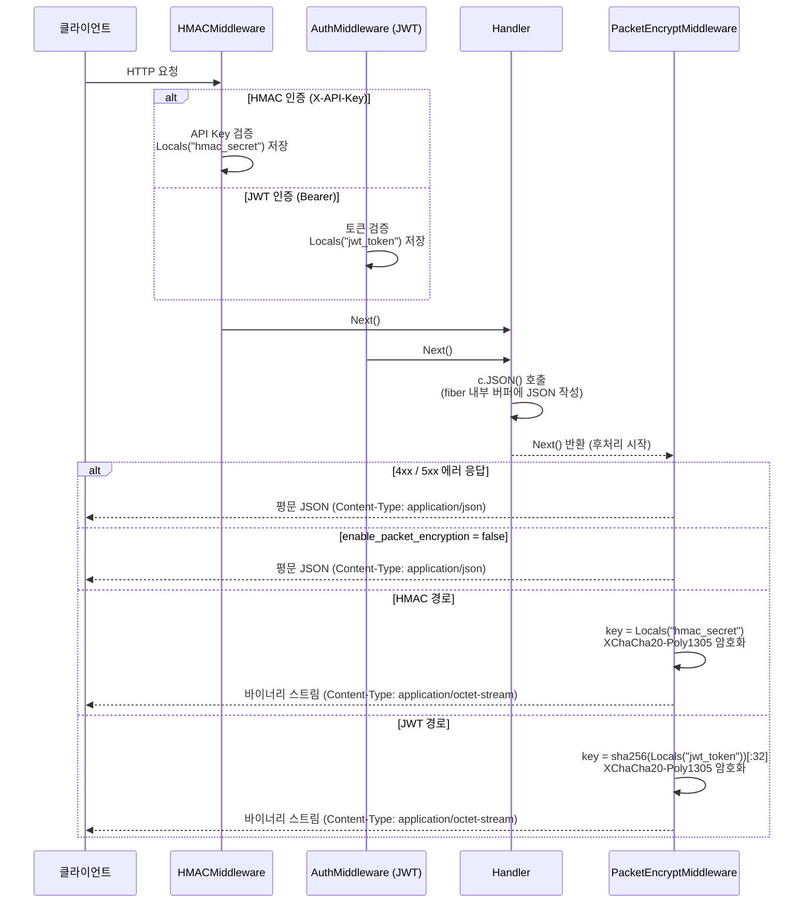
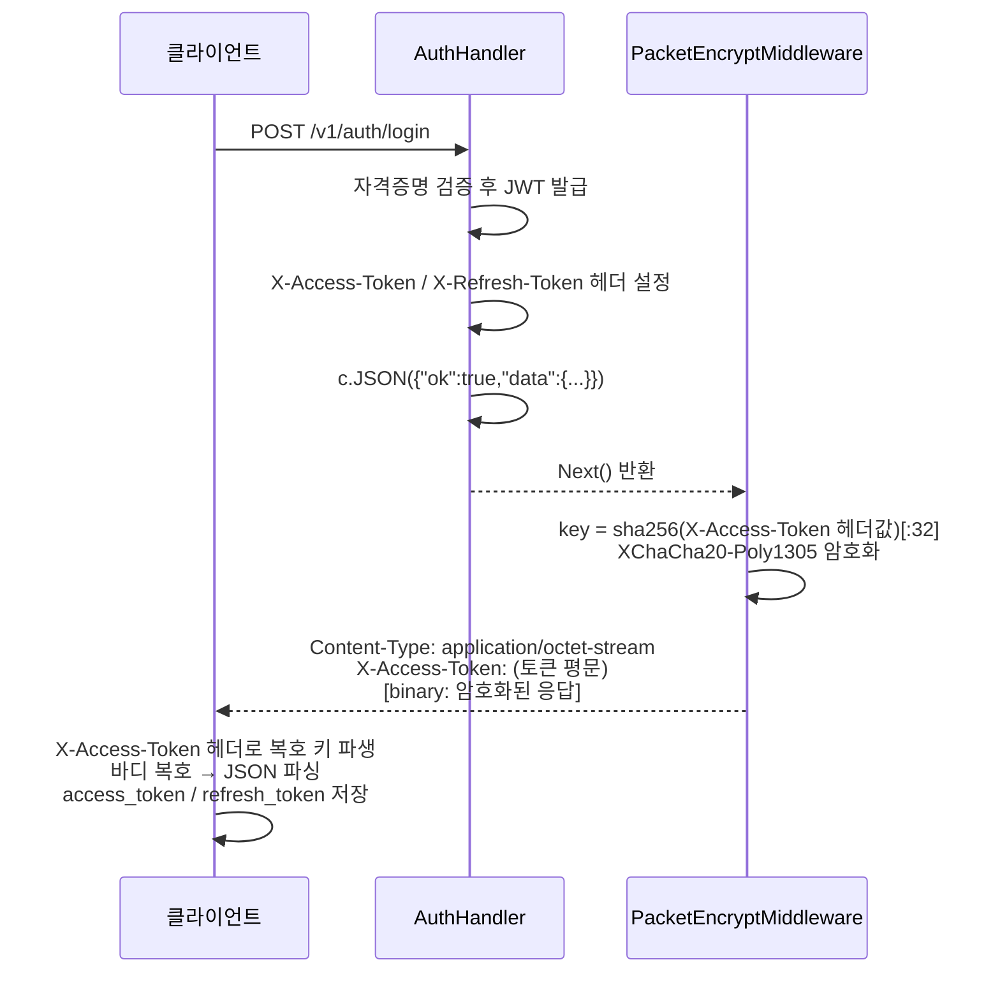

# Encryption Guide (암호화 가이드)

패킷 암호화(응답 스트림 암호화)와 DB 데이터 암호화에 대한 설계·설정·흐름을 설명합니다.

---

## 목차

1. [개요 및 목적](#1-개요-및-목적)
2. [패킷 암호화](#2-패킷-암호화)
    - [설계 목표](#21-설계-목표)
    - [와이어 포맷](#22-와이어-포맷)
    - [키 결정 방식 / X-Signature 생성 규칙](#23-키-결정-방식)
    - [로그인 응답 처리](#24-로그인-응답-처리)
    - [요청-응답 흐름](#25-요청-응답-흐름)
    - [설정 방법](#26-설정-방법)
    - [클라이언트 복호 방법](#27-클라이언트-복호-방법)
3. [DB 데이터 암호화](#3-db-데이터-암호화)
    - [DB 테이블 구조](#31-db-테이블-구조)
    - [암복호화 흐름](#32-암복호화-흐름)
    - [hash 필드 처리](#33-hash-필드-처리)
    - [신규 포맷](#34-신규-포맷)
4. [알고리즘 선택 근거](#4-알고리즘-선택-근거)
5. [장점 평가표](#5-장점-평가표)
6. [주의사항 및 운영 지침](#6-주의사항-및-운영-지침)

---

## 1) 개요 및 목적

이 서버는 두 계층에서 암호화를 적용합니다.

| 계층                 | 대상                         | 목적                                               |
| -------------------- | ---------------------------- | -------------------------------------------------- |
| **패킷 암호화**      | HTTP 응답 바디 전체          | 크롤러/스크래퍼의 데이터 탈취 방지, 응답 내용 은닉 |
| **DB 데이터 암호화** | `data` 컬럼 (전체 필드 JSON) | DB 직접 접근 시 데이터 노출 방지                   |

> **HTTPS와 병행 사용** — 이 암호화는 TLS를 대체하지 않습니다. HTTPS 위에서 추가 보호 계층으로 동작합니다.

---

## 2) 패킷 암호화

### 2.1 설계 목표

- 인증된 성공 응답(2xx)을 바이너리 스트림으로 전송
- 에러 응답(4xx/5xx)은 평문 JSON 유지 — 디버깅·운영 지장 없음
- 암호화 비활성 시 헤더 추가 없음 — 평범한 JSON 서버와 구별 불가
- 별도 키 교환 없음 — 인증에 사용된 키 소재를 재활용
- 구조 자체를 모르면 복호 불가 — magic 길이를 모르면 nonce 시작 위치 파악 불가

### 2.2 와이어 포맷

```
offset 0        ~ K-1     : magic      (K = packet_magic_len 설정값, 요청마다 랜덤 생성)
offset K        ~ K+23    : nonce      (24바이트 고정)
offset K+24     ~ N-17    : ciphertext
offset N-16     ~ N-1     : tag        (16바이트 고정, Poly1305 인증 태그)
```

| 필드         | 크기          | 설명                                                                         |
| ------------ | ------------- | ---------------------------------------------------------------------------- |
| `magic`      | K바이트       | 요청마다 랜덤 생성. 크롤러가 nonce 오프셋을 파악하지 못하게 하는 오프셋 장치 |
| `nonce`      | 24바이트 고정 | XChaCha20-Poly1305 nonce. **요청마다 새로 랜덤 생성**                        |
| `ciphertext` | M바이트       | 암호화된 JSON 페이로드                                                       |
| `tag`        | 16바이트 고정 | Poly1305 인증 태그. 변조 감지 + 복호 무결성 보장                             |

**파싱 규칙 (클라이언트 개발자 기준):**

클라이언트 개발자는 `packet_magic_len` 설정값(K)을 알고 있습니다.

- 앞 K바이트: magic → 건너뜀
- 이후 24바이트: nonce
- 이후 끝에서 16바이트 전까지: ciphertext
- 마지막 16바이트: tag

magic의 **실제 바이트 값**은 클라이언트가 알 필요 없습니다.
길이(K)만 알면 오프셋 계산이 가능합니다.

magic 바이트는 요청마다 바뀌어도 파싱 동작에 영향이 없습니다.
클라이언트는 값이 아닌 길이만 사용합니다.

nonce는 요청마다 새로 랜덤 생성됩니다. magic도 매 요청마다 달라지며,
크롤러는 K를 모르므로 구조 자체를 파싱할 수 없습니다.

### 2.3 키 결정 방식

#### HMAC 인증 (`X-API-Key` 헤더)

```
packet_key = hmac_secret
```

API 키를 보유한 주체라면 누구든 사용할 수 있습니다.
모바일 앱, Electron 클라이언트, 백엔드-서버 간 통신 등.

JWT는 로그인 기반 사용자 인증에 사용하므로,
사용자 세션이 필요 없는 시스템 간 통신에는 HMAC이 적합합니다.

`api-key.sh add`로 API Key를 발급하면 서버 측에서 `API_KEY`와 `API_HMAC_SECRET`이 생성됩니다.
이 두 값을 클라이언트(앱 개발자 또는 연동 서버 운영자)에게 전달해야 합니다.

**HMAC 인증 흐름:**

```
클라이언트 (API_KEY + API_HMAC_SECRET 보유)
  │
  ├─ API_KEY           →  X-API-Key 헤더로 전송 (식별자, 평문 전송)
  └─ API_HMAC_SECRET   →  요청 서명 생성에만 사용 (절대 전송하지 않음)
                            HMAC(timestamp + method + path + body_hash, HMAC_SECRET)
                            → X-Signature 헤더로 서명값만 전송

서버
  └─ X-API-Key로 HMAC_SECRET 조회
       → 동일한 방식으로 서명 재계산 → 비교 → 일치 시 인증 통과
```

**X-Signature 생성 규칙:**

서명 대상 문자열(string to sign):

```
{timestamp}\n{METHOD}\n{path}\n{body_sha256}
```

| 항목          | 값                     | 설명                                                                                        |
| ------------- | ---------------------- | ------------------------------------------------------------------------------------------- |
| `timestamp`   | Unix 초 (정수, 문자열) | `X-Timestamp` 헤더와 동일한 값. **초(seconds) 단위, 밀리초 아님**                           |
| `METHOD`      | 대문자 HTTP 메서드     | `GET`, `POST`, `PUT`, `DELETE` 등                                                           |
| `path`        | 경로 + 쿼리 문자열     | `/v1/entity/user/list?page=1` — 쿼리 없으면 경로만. **수신한 경로/쿼리 raw 값 그대로 사용** |
| `body_sha256` | hex(SHA-256(body))     | **raw body 바이트** 기준 SHA-256, Content-Type 무관                                         |

**`body_sha256` 상세:**

- body가 있는 경우: `hex(SHA-256(raw_body_bytes))`
- body가 없거나 길이 0인 경우(GET 등): 빈 바이트 배열의 해시 고정값 사용
    ```
    e3b0c44298fc1c149afbf4c8996fb92427ae41e4649b934ca495991b7852b855
    ```
- `Content-Type`이 `application/json`, `multipart/form-data` 등 무엇이든 관계없이 **전송된 raw bytes** 그대로 해시
- `multipart/form-data`는 boundary/part 순서/줄바꿈까지 포함한 **원본 raw bytes**가 동일해야 같은 서명이 나옵니다

**`path` 정규화 규칙:**

- URL decode/encode, trailing slash 보정, query 파라미터 재정렬을 하지 않습니다
- 서버가 실제로 수신한 `path?query` 문자열(raw 기준)을 그대로 string to sign에 사용합니다

**`X-Timestamp` 상세:**

```
X-Timestamp: 1708412345   ← Unix seconds (10자리 정수)
             1708412345000 ← 이렇게 하면 안 됨 (ms 단위)
```

서명 계산:

```
signature = lowercase_hex(HMAC-SHA256(string_to_sign, API_HMAC_SECRET))

# 예시
signature = 9f4c2a... (소문자 hex 고정)
```

요청 헤더:

```
X-API-Key:   {API_KEY}
X-Timestamp: {timestamp}
X-Signature: {signature}
```

서버는 `X-Timestamp` 기준 ±`timestamp_skew_sec`(설정값, 기본 300초) 이내 요청만 수락합니다.
재전송 공격 방지를 위해 nonce TTL(`nonce_ttl_sec`) 이내 동일 서명은 거부합니다.

`API_HMAC_SECRET`은 요청 서명(HMAC 검증) 및 패킷 복호 키로 사용하므로,
비밀번호처럼 최초 1회 전달받아 안전하게 보관해야 합니다.

서버는 `HMACConfig.KeySecrets[apiKey]`에서 즉시 조회합니다.

#### JWT 인증 (`Authorization: Bearer`)

```
packet_key = sha256(access_token_string)[:32]
```

- 클라이언트는 자기 토큰 문자열에서 직접 파생 — 별도 키 교환 불필요, stateless
- 토큰이 다르면 키도 달라짐 (세션마다 고유 키)
- 동일 요청/동일 데이터도 nonce가 랜덤이므로 매번 다른 바이트 출력

> **보안 범위:** 이 설계의 보호 대상은 **인증 수단 없이 응답을 읽으려는 크롤러**입니다.
> access_token을 탈취하더라도 `packet_magic_len` 설정값(패킷 구조)을 함께 알지 못하면 복호가 불가능합니다.

### 2.4 로그인 응답 처리

JWT 경로에서 로그인 응답 자체도 암호화합니다. 서버는 JWT를 발급한 직후 **응답 헤더에 토큰을 먼저 쓰고**, 바디는 그 토큰으로 암호화합니다.

```
HTTP/1.1 200 OK
Content-Type: application/octet-stream
X-Access-Token:  eyJhbGciOiJIUzI1NiIsInR5cCI6IkpXVCJ9...
X-Refresh-Token: eyJhbGciOiJIUzI1NiIsInR5cCI6IkpXVCJ9...

[binary: XChaCha20-Poly1305( sha256(access_token)[:32], nonce:24, {"ok":true,"data":{...}} )]
```

클라이언트 처리 순서:

1. `X-Access-Token` 헤더 읽기
2. `sha256(token)[:32]`로 복호 키 파생
3. `Content-Type: application/octet-stream` 확인 → 바이너리 바디 복호
4. 복호된 JSON에서 `data.access_token`, `data.refresh_token` 저장

토큰 갱신(`/v1/auth/refresh`)도 동일 패턴:

- `X-Access-Token: (새 토큰)` 헤더로 복호 키 파생

### 2.5 요청-응답 흐름



<br>

**로그인 흐름 (JWT 발급 + 응답 암호화):**



### 2.6 설정 방법

`configs/security.json`:

```json
{
    "enable_hmac": true,
    "enable_rbac": true,
    "enable_packet_encryption": true,
    "packet_magic_len": 6,
    "timestamp_skew_sec": 300,
    "nonce_ttl_sec": 300
}
```

| 항목                       | 타입 | 기본값 | 설명                                                   |
| -------------------------- | ---- | ------ | ------------------------------------------------------ |
| `enable_packet_encryption` | bool | false  | `true` 시 인증된 모든 2xx 응답 암호화                  |
| `packet_magic_len`         | int  | 4      | 패킷에 삽입할 magic 바이트 수. 최소 2, **4 이상 권장** |

magic 바이트는 요청마다 랜덤으로 생성됩니다.
클라이언트는 값이 아닌 길이(K)만 알면 오프셋 계산이 가능합니다.
설정값 변경 시 클라이언트도 동시에 업데이트해야 합니다.

### 2.7 클라이언트 복호 방법

언어별 구현은 `samples/` 디렉토리의 실제 라이브러리를 참고합니다.

| 언어 / 환경                   | 파일                                                                                                               | 의존성                            |
| ----------------------------- | ------------------------------------------------------------------------------------------------------------------ | --------------------------------- |
| TypeScript (React / 브라우저) | [samples/react/src/api/entityServerClient.ts](../../samples/react/src/api/entityServerClient.ts)                   | `@noble/ciphers`, `@noble/hashes` |
| TypeScript (Node.js)          | [samples/node/src/EntityServerClient.js](../../samples/node/src/EntityServerClient.js)                             | `@noble/ciphers`, `@noble/hashes` |
| Kotlin (Android)              | [samples/kotlin/EntityServerClient.kt](../../samples/kotlin/EntityServerClient.kt)                                 | Bouncy Castle `bcprov-jdk18on`    |
| Swift (iOS)                   | [samples/swift/EntityServerClient.swift](../../samples/swift/EntityServerClient.swift)                             | CryptoSwift SPM                   |
| Flutter (Dart)                | [samples/flutter/lib/entity_server_client.dart](../../samples/flutter/lib/entity_server_client.dart)               | `cryptography`, `http`, `uuid`    |
| Java                          | [samples/java/EntityServerClient.java](../../samples/java/EntityServerClient.java)                                 | Bouncy Castle `bcprov-jdk18on`    |
| Python                        | [samples/python/entity_server.py](../../samples/python/entity_server.py)                                           | `cryptography`                    |
| PHP (CodeIgniter 4)           | [samples/php/ci4/Libraries/EntityServer.php](../../samples/php/ci4/Libraries/EntityServer.php)                     | `ext-sodium` (PHP 7.2+ 내장)      |
| PHP (Laravel)                 | [samples/php/laravel/Services/EntityServerService.php](../../samples/php/laravel/Services/EntityServerService.php) | `ext-sodium` (PHP 7.2+ 내장)      |

`admin-web` 내장 클라이언트는 [admin-web/src/api/client.ts](../../admin-web/src/api/client.ts) 를 참고합니다.

클라이언트는 `Content-Type: application/octet-stream` 수신 시 바이너리 복호를 수행하고,
그 외(에러 응답 등)는 평문 JSON으로 처리합니다.

---

## 3) DB 데이터 암호화

### 3.1 DB 테이블 구조

엔티티별 데이터 테이블:

```sql
-- seq 타입은 DB 방언에 따라 다릅니다:
--   SQLite:     INTEGER PRIMARY KEY AUTOINCREMENT
--   MySQL:      BIGINT UNSIGNED AUTO_INCREMENT PRIMARY KEY
--   PostgreSQL: BIGSERIAL PRIMARY KEY
CREATE TABLE entity_{name}_data (
    seq          INTEGER PRIMARY KEY AUTOINCREMENT,  -- SQLite 기준
    license_seq  INTEGER,          -- license_scope 엔티티만 사용
    data         TEXT NOT NULL,    -- 암호화된 JSON (모든 비인덱스 필드)
    created_by   INTEGER,
    updated_by   INTEGER,
    created_time TIMESTAMP DEFAULT CURRENT_TIMESTAMP,
    updated_time TIMESTAMP DEFAULT CURRENT_TIMESTAMP,
    deleted_time TIMESTAMP         -- soft delete
);
```

```sql
CREATE TABLE entity_{name}_index (
    seq      INTEGER NOT NULL,
    {field1} TEXT,    -- index 선언된 필드 (평문, 검색/정렬 대상)
    {field2} TEXT
);
```

`data` 컬럼에는 **인덱스 선언되지 않은 모든 필드**가 JSON으로 직렬화된 후 암호화되어 저장됩니다.

### 3.2 암복호화 흐름

**쓰기 (INSERT/UPDATE):**

```
입력 데이터 map[string]interface{}
  │
  ├─ index 선언 필드  →  entity_{name}_index 테이블 (평문)
  │
  └─ 전체 필드 JSON 직렬화
       → EncryptData(json, key)      [XChaCha20-Poly1305]
           내부 동작: 랜덤 nonce 24바이트 생성 → 암호화 → [magic(3)][nonce(24)][ciphertext][tag(16)] 조합
       → base64 인코딩
       → entity_{name}_data.data 컬럼에 저장
```

**읽기 (SELECT):**

```
entity_{name}_data.data
  → base64 디코딩
  → DecryptData(bytes, key)          [XChaCha20-Poly1305]
      내부 동작: magic(3) 확인 → nonce(24) 추출 → 복호 + tag 검증 → 원문 반환
  → JSON 파싱
  → map[string]interface{}
  → seq, created_time, updated_time 병합
  → 응답 반환
```

**암호화 키 결정:**

| 엔티티 종류                  | 사용 키                                   |
| ---------------------------- | ----------------------------------------- |
| 일반 엔티티                  | `ENCRYPTION_KEY` (`.env`)                 |
| `license_scope: true` 엔티티 | `license.secret_key` (라이선스별 고유 키) |

### 3.3 hash 필드 처리

엔티티 설정에서 `hash: true`로 선언된 필드(예: `passwd`):

```
원문: "mypassword"
  → SHA-256 해시
  → entity_{name}_index.{field} 에 해시값 저장 (평문 검색 가능)

검색: WHERE passwd = sha256("mypassword")
복원: 불가 (단방향 해시)
```

비밀번호, API 키 등 평문 복원이 불필요한 필드에 사용됩니다.

### 3.4 DB 포맷

```
[magic:3] [nonce:24] [ciphertext:M] [tag:16]
```

DB 데이터 암호화는 패킷 암호화와 **동일한 구현(`crypto/packet.go`)을 사용**하지만, magic은 `packet_magic_len` 설정과 **무관하게 고정 3바이트 버전 문자열**을 사용합니다.

| 버전      | magic 값          | 설명                         |
| --------- | ----------------- | ---------------------------- |
| v1 (현재) | `"001"` (3바이트) | 현행 XChaCha20-Poly1305 포맷 |
| v2 (미래) | `"002"` (3바이트) | 포맷 변경 시 버전 증가       |

`packet_magic_len` 설정을 바꿔도 DB 데이터 복호에는 영향 없습니다.
각 레코드마다 독립적인 nonce가 사용됩니다.

---

## 4) 알고리즘 선택 근거

### XChaCha20-Poly1305 선택 이유

| 항목               | 내용                                                                  |
| ------------------ | --------------------------------------------------------------------- |
| nonce 길이         | **24바이트** — birthday bound $2^{96}$, 랜덤 생성 시 충돌 사실상 불가 |
| 인증 내장          | Poly1305 태그 16바이트 — 암호화와 변조 방지를 단일 연산으로 처리      |
| timing attack 저항 | 상수 시간(constant-time) 구현 보장                                    |
| 하드웨어 독립      | AES-NI 없는 환경에서도 일정한 성능                                    |
| 표준화             | IETF RFC 8439, libsodium 기본 알고리즘                                |
| Go 지원            | `golang.org/x/crypto/chacha20poly1305`                                |

### DB 데이터 암호화도 동일 알고리즘 사용

- `crypto/packet.go` 단일 구현으로 패킷/DB 모두 처리 — 코드 중복 없음
- 변조 방지 태그: DB 직접 조작 시 복호 단계에서 즉시 감지
- 무결성 검증 실패 시 복호 자체가 오류 반환

---

## 5) 장점 평가표

### 패킷 암호화

| 항목              | 평가         | 설명                                        |
| ----------------- | ------------ | ------------------------------------------- |
| 크롤링 방어       | ✅ 완벽      | 바이너리 스트림, JSON 파서로 읽기 불가      |
| 구조 은닉         | ✅ 강함      | magic 길이 미지 → nonce 오프셋 파악 불가    |
| 변조 방지         | ✅ 강함      | Poly1305 태그 — 1비트 변조 시 복호 실패     |
| nonce 재사용 위험 | ✅ 없음      | XChaCha20 24바이트, birthday bound $2^{96}$ |
| 성능              | ✅ 높음      | 소프트웨어로도 고속, 하드웨어 독립          |
| 키 교환           | ✅ 불필요    | 인증 키 소재 재사용                         |
| stateless         | ✅           | 서버 세션 불필요                            |
| 에러 응답         | ✅ 평문 유지 | 운영/디버깅 지장 없음                       |
| 토큰 탈취 시 복호 | ✅ 불가      | 토큰 + 패킷 구조(magic 길이) 동시 인지 필요 |
| 구현 복잡도       | ✅ 낮음      | 미들웨어 후처리, 기존 구조 변경 최소        |

### DB 데이터 암호화

| 항목                | 내용                       |
| ------------------- | -------------------------- |
| 변조 감지           | ✅ Poly1305 태그           |
| 무결성 보장         | ✅ 복호 실패로 즉시 감지   |
| nonce 재사용 안전성 | ✅ 레코드마다 독립 nonce   |
| 코드 공유           | ✅ 패킷 암호화와 동일 구현 |

---

## 6) 주의사항 및 운영 지침

### packet_magic_len 관리

- 클라이언트 개발자는 `packet_magic_len` 값(길이 K)만 알면 됩니다
- magic 실제 바이트 값은 요청마다 랜덤 생성되므로 별도 공유 불필요
- 설정값 변경 시 클라이언트도 동시에 업데이트해야 합니다
- DB 데이터 암호화의 magic은 `packet_magic_len`과 무관하게 고정(`"001"`)이므로, 설정 변경이 기존 DB 데이터 복호에 영향을 주지 않습니다

```json
{
    "packet_magic_len": 4
}
```

### ENCRYPTION_KEY 관리

DB 데이터 암호화의 마스터 키입니다.

- `.env`의 `ENCRYPTION_KEY`에 저장
- 분실 시 기존 데이터 복호 불가 — **반드시 안전하게 백업**
- 변경 시 전체 데이터 재암호화 필요
- `scripts/generate-env-keys.sh --apply`로 초기 생성

### 암호화 활성 여부 확인

```bash
# 응답 Content-Type 확인
curl -s -I -H "X-API-Key: <key>" ... | grep content-type
# application/octet-stream → 패킷 암호화 활성
# application/json         → 암호화 비활성 또는 에러 응답
```

### 에러 응답은 항상 평문

```json
{ "ok": false, "message": "Invalid email or password" }
```

클라이언트는 `Content-Type` 헤더로 암호화 여부를 판단합니다.

| Content-Type               | 처리 방법                     |
| -------------------------- | ----------------------------- |
| `application/octet-stream` | 바이너리 복호 후 JSON 파싱    |
| `application/json`         | 평문 JSON 파싱 (에러 응답 등) |
