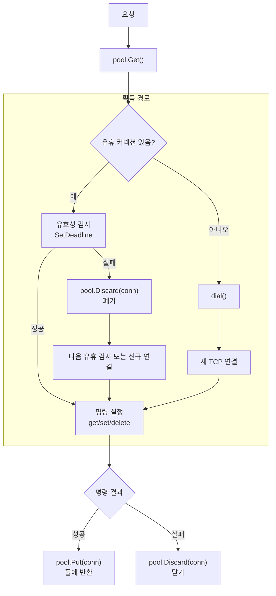

# Memcache 커넥션 풀

## 개요

Memcache 드라이버는 TCP 커넥션 풀을 사용하여 연결을 재사용합니다.
매 요청마다 새 TCP 연결을 생성하는 대신, 유휴 커넥션을 풀에서 꺼내 사용하고 완료 후 반환합니다.

캐시 저장소(`MemcacheStore`)와 Nonce 저장소(`MemcacheNonceStore`) 모두 동일한 `ConnPool`을 사용합니다.

## 구조

```
internal/cache/conn_pool.go          ← 공유 커넥션 풀
internal/cache/memcache_store.go     ← 캐시 저장소 (Get/Set/Delete)
internal/security/nonce_store_memcache.go  ← Nonce 저장소 (Has/Add)
```

## 동작 방식

### 커넥션 획득 (`Get`)

1. 풀에 유휴 커넥션이 있으면 꺼냄 (LIFO — 가장 최근 반환된 커넥션 우선)
2. `SetDeadline`으로 유효성 검사 — 실패하면 폐기하고 다음 시도
3. 유휴 커넥션이 없으면 서버 목록을 순회하며 새 TCP 연결 수립

### 커넥션 반환 (`Put`)

1. 풀이 닫혔거나 유휴 수가 `maxIdle` 이상이면 커넥션 닫기
2. 그렇지 않으면 deadline을 제거하고 풀에 반환

### 커넥션 폐기 (`Discard`)

- I/O 오류, 프로토콜 오류 등 커넥션이 오염된 경우 즉시 닫기
- 풀에 반환하지 않음

### 커넥션 수명주기 다이어그램



## 설정

### cache.json (캐시 저장소)

```json
{
    "drivers": {
        "memcached": {
            "servers": ["127.0.0.1:11211"],
            "max_idle_conns": 10
        }
    }
}
```

### security.json (Nonce 저장소)

```json
{
    "nonce_store": {
        "driver": "memcache",
        "memcache_servers": ["127.0.0.1:11211"],
        "memcache_max_idle": 10
    }
}
```

### 설정 필드

| 필드                | 타입   | 기본값 | 설명                             |
| ------------------- | ------ | ------ | -------------------------------- |
| `max_idle_conns`    | number | 10     | 캐시 저장소 최대 유휴 커넥션 수  |
| `memcache_max_idle` | number | 10     | Nonce 저장소 최대 유휴 커넥션 수 |

- `maxIdle`이 0 이하이면 기본값 10이 적용됩니다.
- 타임아웃은 2초로 고정됩니다 (커넥션 수립 + I/O 모두).
- `maxOpen` 제한은 없습니다. 유휴 커넥션 수만 제한합니다.

## 사용 패턴

모든 Memcache 명령은 동일한 패턴을 따릅니다:

```go
conn, err := s.pool.Get()
if err != nil {
    return err
}

// 명령 실행
_, err = fmt.Fprintf(conn, "get %s\r\n", key)
if err != nil {
    s.pool.Discard(conn) // I/O 오류 → 폐기
    return err
}

// 응답을 완전히 읽은 후
s.pool.Put(conn) // 성공 → 반환
```

**핵심 규칙**: 커넥션을 풀에 반환하기 전에 **Memcache 응답을 반드시 끝까지 읽어야** 합니다. 응답이 남아있으면 다음 사용자가 이전 응답 데이터를 받게 됩니다.

## Memcache 프로토콜 응답 소비

### Get 응답 구조

```
VALUE <key> <flags> <bytes>\r\n    ← 헤더
<data bytes>\r\n                   ← 값 데이터
END\r\n                            ← 종료 마커

또는

END\r\n                            ← 캐시 미스
```

풀에 반환하려면 `END\r\n`까지 완전히 읽어야 합니다:

```go
// 1. 헤더 읽기 (VALUE 또는 END)
line, _ := r.ReadString('\n')

if line == "END" {
    pool.Put(conn)  // 미스: 이미 완전 소비됨
    return
}

// 2. VALUE인 경우: 데이터 바이트 읽기
io.ReadFull(r, value)
// 3. trailing \r\n 소비
r.ReadString('\n')
// 4. END\r\n 소비
r.ReadString('\n')

pool.Put(conn)  // 모든 응답 소비 완료
```

### Set/Delete 응답

```
STORED\r\n    또는    NOT_STORED\r\n    또는    DELETED\r\n
```

한 줄을 읽으면 응답이 완전히 소비됩니다.

## 주의사항

### maxIdle 튜닝 가이드

| 환경        | 권장 값 | 이유                         |
| ----------- | ------- | ---------------------------- |
| 개발/테스트 | 5       | 리소스 절약                  |
| 단일 서버   | 10      | 기본값, 대부분 충분          |
| 고부하 서버 | 20–50   | 동시 요청이 많으면 확대 필요 |

- `maxIdle`이 너무 작으면 → 자주 새 연결을 생성 (풀 효과 감소)
- `maxIdle`이 너무 크면 → 유휴 커넥션이 서버 리소스를 점유

### 오류 복구

- Memcache 서버 재시작 시: 기존 풀 커넥션은 `Get()` 유효성 검사에서 자동 폐기
- 네트워크 단절 시: I/O 오류 발생 → `Discard()` → 다음 요청에서 재연결 시도
- 별도의 헬스체크 고루틴은 없습니다. 사용 시점에 lazy 검증합니다.

### 외부 의존성

없음. 표준 라이브러리(`net`, `sync`, `bufio`)만 사용합니다.
