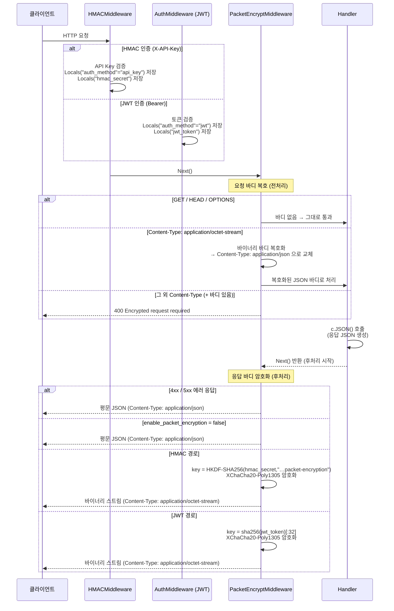
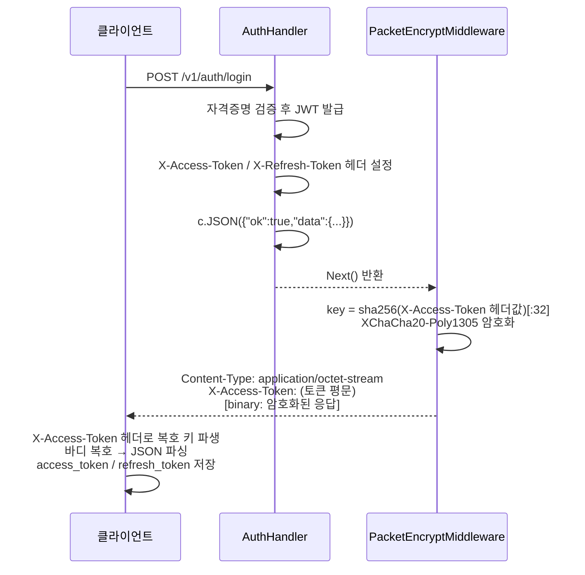

# Encryption Guide (암호화 가이드)

패킷 암호화(요청/응답 양방향 암호화)와 DB 데이터 암호화에 대한 설계·설정·흐름을 설명합니다.

---

## 목차

1. [개요 및 목적](#1-개요-및-목적)
2. [패킷 암호화](#2-패킷-암호화)
    - [설계 목표](#21-설계-목표)
    - [와이어 포맷](#22-와이어-포맷)
    - [키 결정 방식 / X-Signature 생성 규칙](#23-키-결정-방식)
    - [로그인 응답 처리](#24-로그인-응답-처리)
    - [요청-응답 흐름 (양방향)](#25-요청-응답-흐름)
    - [설정 방법](#26-설정-방법)
    - [헬스 체크 및 자동 감지](#27-헬스-체크-및-자동-감지)
    - [클라이언트 복호 방법](#28-클라이언트-복호-방법)
3. [DB 데이터 암호화](#3-db-데이터-암호화)
    - [DB 테이블 구조](#31-db-테이블-구조)
    - [암복호화 흐름](#32-암복호화-흐름)
    - [hash 필드 처리](#33-hash-필드-처리)
    - [DB 포맷](#34-db-포맷)
4. [알고리즘 선택 근거](#4-알고리즘-선택-근거)
5. [장점 평가표](#5-장점-평가표)
6. [주의사항 및 운영 지침](#6-주의사항-및-운영-지침)

---

## 1) 개요 및 목적

이 서버는 두 계층에서 암호화를 적용합니다.

| 계층                 | 대상                           | 목적                                               |
| -------------------- | ------------------------------ | -------------------------------------------------- |
| **패킷 암호화**      | HTTP **요청 + 응답** 바디 전체 | 크롤러/스크래퍼의 데이터 탈취 방지, 패킷 내용 은닉 |
| **DB 데이터 암호화** | `data` 컬럼 (전체 필드 JSON)   | DB 직접 접근 시 데이터 노출 방지                   |

> **HTTPS와 병행 사용** — 이 암호화는 TLS를 대체하지 않습니다. HTTPS 위에서 추가 보호 계층으로 동작합니다.

---

## 2) 패킷 암호화

### 2.1 설계 목표

- 인증된 성공 응답(2xx)을 바이너리 스트림으로 전송 — **응답 암호화**
- **요청 바디도 암호화** (`encryptRequests: true` 클라이언트 옵션 활성화 시) — **요청 암호화**
- 패킷 암호화가 활성화된 서버에서 평문 요청이 수신되면 **400 오류** 반환
- 에러 응답(4xx/5xx)은 평문 JSON 유지 — 디버깅·운영 지장 없음
- 암호화 비활성 시 헤더 추가 없음 — 평범한 JSON 서버와 구별 불가
- 별도 키 교환 없음 — 인증에 사용된 키 소재를 재활용
- 구조 자체를 모르면 복호 불가 — magic 길이를 모르면 nonce 시작 위치 파악 불가
- **`/v1/admin/` 라우트는 적용 제외** — admin-web 전용 경로로, plain JSON 통신. HMAC 서명 + RBAC 인가로 보호됨

### 2.2 와이어 포맷

```
offset 0        ~ K-1     : magic      (K = 2 + key[31] % 14, 패킷 키에서 자동 파생)
offset K        ~ K+23    : nonce      (24바이트 고정)
offset K+24     ~ N-17    : ciphertext
offset N-16     ~ N-1     : tag        (16바이트 고정, Poly1305 인증 태그)
```

| 필드         | 크기          | 설명                                                                         |
| ------------ | ------------- | ---------------------------------------------------------------------------- |
| `magic`      | K바이트       | 요청마다 랜덤 생성. 크롤러가 nonce 오프셋을 파악하지 못하게 하는 오프셋 장치 |
| `nonce`      | 24바이트 고정 | XChaCha20-Poly1305 nonce. **요청마다 새로 랜덤 생성**                        |
| `ciphertext` | M바이트       | 암호화된 JSON 페이로드                                                       |
| `tag`        | 16바이트 고정 | Poly1305 인증 태그. 변조 감지 + 복호 무결성 보장                             |

**파싱 규칙 (클라이언트 개발자 기준):**

K는 패킷 키의 마지막 바이트에서 자동 계산됩니다: `K = 2 + key[31] % 14` (범위 [2, 15]).
서버와 클라이언트가 동일한 패킷 키를 보유하면 별도 설정이나 전달 없이 일치합니다.

- 앞 K바이트: magic → 건너뜀
- 이후 24바이트: nonce
- 이후 끝에서 16바이트 전까지: ciphertext
- 마지막 16바이트: tag

magic의 **실제 바이트 값**은 클라이언트가 알 필요 없습니다.
길이(K)만 알면 오프셋 계산이 가능합니다.

magic 바이트는 요청마다 바뀌어도 파싱 동작에 영향이 없습니다.
클라이언트는 값이 아닌 길이만 사용합니다.

nonce는 요청마다 새로 랜덤 생성됩니다. magic도 매 요청마다 달라지며,
크롤러는 K를 모르므로 구조 자체를 파싱할 수 없습니다.

### 2.3 키 결정 방식

#### HMAC 인증 (`X-API-Key` 헤더)

```
packet_key = HKDF-SHA256(hmac_secret, info="entity-server:packet-encryption", salt="entity-server:hkdf:v1", len=32)
```

API 키를 보유한 주체라면 누구든 사용할 수 있습니다.
모바일 앱, Electron 클라이언트, 백엔드-서버 간 통신 등.

JWT는 로그인 기반 사용자 인증에 사용하므로,
사용자 세션이 필요 없는 시스템 간 통신에는 HMAC이 적합합니다.

`api-key.sh add`로 API Key를 발급하면 서버 측에서 `API_KEY`와 `API_HMAC_SECRET`이 생성됩니다.
이 두 값을 클라이언트(앱 개발자 또는 연동 서버 운영자)에게 전달해야 합니다.

**HMAC 인증 흐름:**

```
클라이언트 (API_KEY + API_HMAC_SECRET 보유)
  │
  ├─ API_KEY           →  X-API-Key 헤더로 전송 (식별자, 평문 전송)
  └─ API_HMAC_SECRET   →  요청 서명 생성에만 사용 (절대 전송하지 않음)
                            HMAC(timestamp + method + path + body_hash, HMAC_SECRET)
                            → X-Signature 헤더로 서명값만 전송

서버
  └─ X-API-Key로 HMAC_SECRET 조회
       → 동일한 방식으로 서명 재계산 → 비교 → 일치 시 인증 통과
```

**X-Signature 생성 규칙:**

서명 대상 문자열(string to sign):

```
{timestamp}\n{METHOD}\n{path}\n{body_sha256}
```

| 항목          | 값                     | 설명                                                                                        |
| ------------- | ---------------------- | ------------------------------------------------------------------------------------------- |
| `timestamp`   | Unix 초 (정수, 문자열) | `X-Timestamp` 헤더와 동일한 값. **초(seconds) 단위, 밀리초 아님**                           |
| `METHOD`      | 대문자 HTTP 메서드     | `GET`, `POST`, `PUT`, `DELETE` 등                                                           |
| `path`        | 경로 + 쿼리 문자열     | `/v1/entity/user/list?page=1` — 쿼리 없으면 경로만. **수신한 경로/쿼리 raw 값 그대로 사용** |
| `body_sha256` | hex(SHA-256(body))     | **raw body 바이트** 기준 SHA-256, Content-Type 무관                                         |

**`body_sha256` 상세:**

- body가 있는 경우: `hex(SHA-256(raw_body_bytes))`
- body가 없거나 길이 0인 경우(GET 등): 빈 바이트 배열의 해시 고정값 사용
    ```
    e3b0c44298fc1c149afbf4c8996fb92427ae41e4649b934ca495991b7852b855
    ```
- `Content-Type`이 `application/json`, `multipart/form-data` 등 무엇이든 관계없이 **전송된 raw bytes** 그대로 해시
- `multipart/form-data`는 boundary/part 순서/줄바꿈까지 포함한 **원본 raw bytes**가 동일해야 같은 서명이 나옵니다

**`path` 정규화 규칙:**

- URL decode/encode, trailing slash 보정, query 파라미터 재정렬을 하지 않습니다
- 서버가 실제로 수신한 `path?query` 문자열(raw 기준)을 그대로 string to sign에 사용합니다

**`X-Timestamp` 상세:**

```
X-Timestamp: 1708412345   ← Unix seconds (10자리 정수)
             1708412345000 ← 이렇게 하면 안 됨 (ms 단위)
```

서명 계산:

```
signature = lowercase_hex(HMAC-SHA256(string_to_sign, API_HMAC_SECRET))

# 예시
signature = 9f4c2a... (소문자 hex 고정)
```

요청 헤더:

```
X-API-Key:   {API_KEY}
X-Timestamp: {timestamp}
X-Signature: {signature}
```

서버는 `X-Timestamp` 기준 ±`timestamp_skew_sec`(설정값, 기본 300초) 이내 요청만 수락합니다.
재전송 공격 방지를 위해 nonce TTL(`nonce_ttl_sec`) 이내 동일 서명은 거부합니다.

`API_HMAC_SECRET`은 요청 서명(HMAC 검증) 및 패킷 복호 키로 사용하므로,
비밀번호처럼 최초 1회 전달받아 안전하게 보관해야 합니다.

서버는 `HMACConfig.KeySecrets[apiKey]`에서 즉시 조회합니다.

#### JWT 인증 (`Authorization: Bearer`)

```
packet_key = sha256(access_token_string)[:32]
```

- 클라이언트는 자기 토큰 문자열에서 직접 파생 — 별도 키 교환 불필요, stateless
- 토큰이 다르면 키도 달라짐 (세션마다 고유 키)
- 동일 요청/동일 데이터도 nonce가 랜덤이므로 매번 다른 바이트 출력

> **보안 범위:** 이 설계의 보호 대상은 **인증 수단 없이 응답을 읽으려는 크롤러**입니다.
> access_token을 탈취하더라도 패킷 키가 없으면 복호가 불가능합니다. (magic 길이는 패킷 키에서 자동 파생되므로 별도 노출 없음)

### 2.4 로그인 응답 처리

JWT 경로에서 로그인 응답 자체도 암호화합니다. 서버는 JWT를 발급한 직후 **응답 헤더에 토큰을 먼저 쓰고**, 바디는 그 토큰으로 암호화합니다.

```
HTTP/1.1 200 OK
Content-Type: application/octet-stream
X-Access-Token:  eyJhbGciOiJIUzI1NiIsInR5cCI6IkpXVCJ9...
X-Refresh-Token: eyJhbGciOiJIUzI1NiIsInR5cCI6IkpXVCJ9...

[binary: XChaCha20-Poly1305( sha256(access_token)[:32], nonce:24, {"ok":true,"data":{...}} )]
```

클라이언트 처리 순서:

1. `X-Access-Token` 헤더 읽기
2. `sha256(token)[:32]`로 복호 키 파생
3. `Content-Type: application/octet-stream` 확인 → 바이너리 바디 복호
4. 복호된 JSON에서 `data.access_token`, `data.refresh_token` 저장

토큰 갱신(`/v1/auth/refresh`)도 동일 패턴:

- `X-Access-Token: (새 토큰)` 헤더로 복호 키 파생

<a id="25-요청-응답-흐름"></a>

### 2.5 요청-응답 흐름 (양방향)



<br>

**로그인 흐름 (JWT 발급 + 응답 암호화):**



### 2.6 설정 방법

`configs/auth/security.json`:

```json
{
    "enable_hmac": true,
    "enable_rbac": true,
    "enable_packet_encryption": true,
    "timestamp_skew_sec": 300,
    "nonce_ttl_sec": 300
}
```

| 항목                       | 타입 | 기본값 | 설명                                                          |
| -------------------------- | ---- | ------ | ------------------------------------------------------------- |
| `enable_packet_encryption` | bool | false  | `true` 시 인증된 모든 2xx 응답 암호화. **요청도 암호화 필수** |

> `packet_magic_len` 설정은 더 이상 필요하지 않습니다.  
> magic 길이(K)는 `K = 2 + key[31] % 14` 공식으로 패킷 키에서 자동 파생되어 서버/클라이언트가 항상 일치합니다.

> **`enable_packet_encryption = true` 일 때 주의:**  
> 서버가 인증된 요청에서 평문 바디를 수신하면 **400 Encrypted request required** 를 반환합니다.  
> 클라이언트에서 반드시 `encryptRequests: true` 를 설정해야 합니다.

magic 바이트는 요청마다 랜덤으로 생성됩니다.
클라이언트는 패킷 키를 보유하면 K를 자동 계산할 수 있으므로 별도 설정 공유가 필요 없습니다.

### 2.6.1 enable_packet_encryption + 인증 조합별 동작

`enable_packet_encryption = true`로 설정하면, 패킷 암호화 미들웨어는 요청 컨텍스트에 `auth_method`가 세팅된 경우에 동작합니다.
`auth_method`는 **HMAC 미들웨어**(`api_key`)와 **JWT 미들웨어**(`jwt` 또는 `api_key`) 모두 세팅합니다.
HMAC 미들웨어가 서명 검증 성공 시 직접 `auth_method=api_key`를 세팅하므로, JWT 활성 여부와 무관하게 HMAC 요청도 패킷 암호화가 동작합니다.

#### 미들웨어 실행 순서

```
요청 → HMACMiddleware → AuthMiddleware(JWT) → RBACMiddleware → PacketEncryptMiddleware → Handler
```

#### 조합별 동작 매트릭스

| `enable_hmac` | `jwt.enabled` | 요청 인증 방식          | `auth_method` 세팅 주체                              | 패킷 암호화 |
| :-----------: | :-----------: | ----------------------- | ---------------------------------------------------- | :---------: |
|     true      |     true      | `X-API-Key` + HMAC 서명 | HMAC 미들웨어가 `api_key` 세팅 (JWT 미들웨어도 세팅) |   ✅ 동작   |
|     true      |   **false**   | `X-API-Key` + HMAC 서명 | HMAC 미들웨어가 `api_key` 세팅                       |   ✅ 동작   |
|       —       |     true      | `Authorization: Bearer` | JWT 미들웨어가 토큰 검증 후 `jwt` 세팅               |   ✅ 동작   |

#### Case 1: HMAC + JWT 활성화 (`enable_hmac: true`, `jwt.enabled: true`)

```
클라이언트 (X-API-Key + HMAC 서명)
│
├─ HMACMiddleware    : 서명 검증 통과 → Locals("hmac_secret", secret)
├─ AuthMiddleware    : X-API-Key 헤더 감지 →  Locals("auth_method", "api_key")
└─ PacketEncrypt     : auth_method="api_key" + hmac_secret 있음
                       → key = HKDF-SHA256(hmac_secret, "entity-server:packet-encryption")
                       → 요청 복호 + 응답 암호화  ✅
```

#### Case 2: HMAC + JWT **비활성화** (`enable_hmac: true`, `jwt.enabled: false`)

```
클라이언트 (X-API-Key + HMAC 서명)
│
├─ HMACMiddleware    : 서명 검증 통과 → Locals("auth_method", "api_key")
│                                      Locals("hmac_secret", secret)
├─ AuthMiddleware    : (등록 안 됨 — jwt.enabled=false)
└─ PacketEncrypt     : auth_method="api_key" + hmac_secret 있음
                       → key = HKDF-SHA256(hmac_secret, "entity-server:packet-encryption")
                       → 요청 복호 + 응답 암호화  ✅
```

> HMAC 미들웨어가 서명 검증 성공 시 직접 `auth_method=api_key`를 세팅하므로,
> JWT 미들웨어 활성화 여부와 무관하게 패킷 암호화가 동작합니다.

#### Case 3: JWT Bearer (`jwt.enabled: true`)

```
클라이언트 (Authorization: Bearer <token>)
│
├─ HMACMiddleware    : Bearer 헤더 감지 → HMAC 검증 건너뜀
├─ AuthMiddleware    : 토큰 검증 통과 → Locals("auth_method", "jwt")
│                                      Locals("jwt_token", tokenStr)
└─ PacketEncrypt     : auth_method="jwt" + jwt_token 있음
                       → key = sha256(jwt_token)[:32]
                       → 요청 복호 + 응답 암호화  ✅
```

#### 요약

| 시나리오                   | 패킷 암호화 작동 여부 |
| -------------------------- | :-------------------: |
| JWT Bearer 요청 (JWT 활성) |          ✅           |
| HMAC 요청 + JWT 활성       |          ✅           |
| HMAC 요청 + JWT **비활성** |          ✅           |

### 2.7 헬스 체크 및 자동 감지

`GET /v1/health` 는 인증 없이 호출 가능한 상태 확인 엔드포인트입니다.
**패킷 암호화가 활성화된 경우에만** `packet_encryption: true` 필드가 응답에 포함됩니다.
비활성 시에는 필드 자체가 생략됩니다.

```
# 패킷 암호화 비활성 (기본)
GET /v1/health
→ { "ok": true }

# 패킷 암호화 활성 (enable_packet_encryption = true)
GET /v1/health
→ { "ok": true, "packet_encryption": true }
```

클라이언트는 `checkHealth()` 메서드를 초기화 시 호출하여 암호화 설정을 자동으로 감지할 수 있습니다.
`packet_encryption: true` 를 수신하면 이후 모든 요청에 암호화가 자동 적용됩니다.

> **주의:** `packet_magic_len` (magic 바이트 길이)은 헬스 체크 응답에 포함되지 않습니다.
> magic 길이(K)는 `K = 2 + key[31] % 14` 공식으로 패킷 키에서 자동 파생되므로 별도 관리가 필요 없습니다.

### 2.8 클라이언트 복호 방법

TypeScript(React/브라우저) 환경은 공용 패키지 `entity-client` 사용을 권장합니다.

```bash
npm install entity-client
```

```ts
import { entityServer } from "entity-client";

// 1) 기본 설정 (baseUrl)
entityServer.configure({
    baseUrl: import.meta.env.ENTITY_SERVER_URL,
});

// 2) 헬스 체크로 암호화 자동 감지 (packet_encryption: true 이면 encryptRequests 자동 활성)
await entityServer.checkHealth();

// 3) 이후 모든 요청에 암호화가 자동 적용됨
```

언어별 구현은 `samples/` 디렉토리를 참고합니다.

| 언어 / 환경                   | 파일                   | 의존성                            |
| ----------------------------- | ---------------------- | --------------------------------- |
| TypeScript (React / 브라우저) | `entity-client` | `@noble/ciphers`, `@noble/hashes` |
| TypeScript (Node.js)          | `samples/node`         | `@noble/ciphers`, `@noble/hashes` |
| Kotlin (Android)              | `samples/kotlin`       | Bouncy Castle `bcprov-jdk18on`    |
| Swift (iOS)                   | `samples/swift`        | CryptoSwift SPM                   |
| Flutter (Dart)                | `samples/flutter`      | `cryptography`, `http`, `uuid`    |
| Java                          | `samples/java`         | Bouncy Castle `bcprov-jdk18on`    |
| Python                        | `samples/python`       | `cryptography`                    |
| PHP (CodeIgniter 4)           | `samples/php/ci4`      | `ext-sodium` (PHP 7.2+ 내장)      |
| PHP (Laravel)                 | `samples/php/laravel`  | `ext-sodium` (PHP 7.2+ 내장)      |

`admin-web` 내장 클라이언트도 동일한 프로토콜을 사용합니다.

클라이언트는 `Content-Type: application/octet-stream` 수신 시 바이너리 복호를 수행하고,
그 외(에러 응답 등)는 평문 JSON으로 처리합니다.

---

## 3) DB 데이터 암호화

### 3.1 DB 테이블 구조

엔티티별로 3개의 테이블이 생성됩니다:

| 테이블                  | 용도                                    |
| ----------------------- | --------------------------------------- |
| `entity_data_{name}`    | 암호화된 전체 필드 JSON (`data` 컬럼)   |
| `entity_idx_{name}`     | 인덱스 선언 필드 (평문, 검색·정렬 대상) |
| `entity_history_{name}` | 변경 이력 스냅샷                        |

```sql
-- seq 타입은 DB 방언에 따라 다릅니다:
--   SQLite:     INTEGER PRIMARY KEY AUTOINCREMENT
--   MySQL:      BIGINT UNSIGNED AUTO_INCREMENT PRIMARY KEY
--   PostgreSQL: BIGSERIAL PRIMARY KEY
CREATE TABLE entity_data_{name} (
    seq          INTEGER PRIMARY KEY AUTOINCREMENT,  -- SQLite 기준
    license_seq  INTEGER,          -- license_scope 엔티티만 사용
    data         TEXT NOT NULL,    -- 암호화된 JSON (모든 비인덱스 필드)
    created_by   INTEGER,
    updated_by   INTEGER,
    created_time TIMESTAMP DEFAULT CURRENT_TIMESTAMP,
    updated_time TIMESTAMP DEFAULT CURRENT_TIMESTAMP,
    deleted_time TIMESTAMP         -- soft delete
);
```

```sql
CREATE TABLE entity_idx_{name} (
    seq      INTEGER NOT NULL,
    {field1} TEXT,    -- index 선언된 필드 (평문, 검색/정렬 대상)
    {field2} TEXT
);
```

```sql
CREATE TABLE entity_history_{name} (
    seq           INTEGER PRIMARY KEY AUTOINCREMENT,
    data_seq      INTEGER NOT NULL,   -- entity_data_{name}.seq 참조
    action        TEXT NOT NULL,      -- INSERT / UPDATE / DELETE_SOFT / DELETE_HARD / ROLLBACK
    data_snapshot TEXT,               -- 변경 당시 암호화된 데이터 스냅샷
    changed_by    INTEGER,
    changed_time  TIMESTAMP DEFAULT CURRENT_TIMESTAMP
);
```

`data` 컬럼에는 **인덱스 선언되지 않은 모든 필드**가 JSON으로 직렬화된 후 암호화되어 저장됩니다.

### 3.2 암복호화 흐름

**쓰기 (INSERT/UPDATE):**

```
입력 데이터 map[string]interface{}
  │
  ├─ index 선언 필드  →  entity_idx_{name} 테이블 (평문)
  │
  └─ 전체 필드 JSON 직렬화
       → EncryptData(json, key)      [XChaCha20-Poly1305]
           내부 동작: 랜덤 nonce 24바이트 생성 → 암호화 → [magic(3)][nonce(24)][ciphertext][tag(16)] 조합
       → base64 인코딩
       → entity_data_{name}.data 컬럼에 저장
```

**읽기 (SELECT):**

```
entity_data_{name}.data
  → base64 디코딩
  → DecryptData(bytes, key)          [XChaCha20-Poly1305]
      내부 동작: magic(3) 확인 → nonce(24) 추출 → 복호 + tag 검증 → 원문 반환
  → JSON 파싱
  → map[string]interface{}
  → seq, created_time, updated_time 병합
  → 응답 반환
```

**암호화 키 결정:**

| 엔티티 종류                  | 사용 키                                   |
| ---------------------------- | ----------------------------------------- |
| 일반 엔티티                  | `ENCRYPTION_KEY` (`.env`)                 |
| `license_scope: true` 엔티티 | `license.secret_key` (라이선스별 고유 키) |

### 3.3 hash 필드 처리

엔티티 설정에서 `hash: true`로 선언된 필드(예: `passwd`):

```
원문: "mypassword"
  → SHA-256 해시
  → entity_idx_{name}.{field} 에 해시값 저장 (평문 검색 가능)

검색: WHERE passwd = sha256("mypassword")
복원: 불가 (단방향 해시)
```

비밀번호, API 키 등 평문 복원이 불필요한 필드에 사용됩니다.

### 3.4 DB 포맷

```
[magic:3] [nonce:24] [ciphertext:M] [tag:16]
```

DB 데이터 암호화는 패킷 암호화와 **동일한 구현(`crypto/packet.go`)을 사용**하지만, magic은 패킷 키 파생 방식과 **무관하게 고정 3바이트 버전 문자열**을 사용합니다.

| 버전      | magic 값          | 설명                         |
| --------- | ----------------- | ---------------------------- |
| v1 (현재) | `"001"` (3바이트) | 현행 XChaCha20-Poly1305 포맷 |
| v2 (미래) | `"002"` (3바이트) | 포맷 변경 시 버전 증가       |

패킷 magic 길이 변전은 DB 데이터 복호에는 영향 없습니다.
각 레코드마다 독립적인 nonce가 사용됩니다.

---

## 4) 알고리즘 선택 근거

### XChaCha20-Poly1305 선택 이유

| 항목               | 내용                                                                  |
| ------------------ | --------------------------------------------------------------------- |
| nonce 길이         | **24바이트** — birthday bound $2^{96}$, 랜덤 생성 시 충돌 사실상 불가 |
| 인증 내장          | Poly1305 태그 16바이트 — 암호화와 변조 방지를 단일 연산으로 처리      |
| timing attack 저항 | 상수 시간(constant-time) 구현 보장                                    |
| 하드웨어 독립      | AES-NI 없는 환경에서도 일정한 성능                                    |
| 표준화             | IETF RFC 8439, libsodium 기본 알고리즘                                |
| Go 지원            | `golang.org/x/crypto/chacha20poly1305`                                |

### DB 데이터 암호화도 동일 알고리즘 사용

- `crypto/packet.go` 단일 구현으로 패킷/DB 모두 처리 — 코드 중복 없음
- 변조 방지 태그: DB 직접 조작 시 복호 단계에서 즉시 감지
- 무결성 검증 실패 시 복호 자체가 오류 반환

---

## 5) 장점 평가표

### 패킷 암호화

| 항목              | 평가         | 설명                                        |
| ----------------- | ------------ | ------------------------------------------- |
| 크롤링 방어       | ✅ 완벽      | 바이너리 스트림, JSON 파서로 읽기 불가      |
| 구조 은닉         | ✅ 강함      | magic 길이 미지 → nonce 오프셋 파악 불가    |
| 변조 방지         | ✅ 강함      | Poly1305 태그 — 1비트 변조 시 복호 실패     |
| nonce 재사용 위험 | ✅ 없음      | XChaCha20 24바이트, birthday bound $2^{96}$ |
| 성능              | ✅ 높음      | 소프트웨어로도 고속, 하드웨어 독립          |
| 키 교환           | ✅ 불필요    | 인증 키 소재 재사용                         |
| stateless         | ✅           | 서버 세션 불필요                            |
| 에러 응답         | ✅ 평문 유지 | 운영/디버깅 지장 없음                       |
| 토큰 탈취 시 복호 | ✅ 불가      | 토큰 + 패킷 구조(magic 길이) 동시 인지 필요 |
| 구현 복잡도       | ✅ 낮음      | 미들웨어 후처리, 기존 구조 변경 최소        |

### DB 데이터 암호화

| 항목                | 내용                       |
| ------------------- | -------------------------- |
| 변조 감지           | ✅ Poly1305 태그           |
| 무결성 보장         | ✅ 복호 실패로 즉시 감지   |
| nonce 재사용 안전성 | ✅ 레코드마다 독립 nonce   |
| 코드 공유           | ✅ 패킷 암호화와 동일 구현 |

---

## 6) 주의사항 및 운영 지침

### magic 길이 관리

- magic 길이(K)는 `K = 2 + key[31] % 14` 공식으로 패킷 키에서 자동 파생됩니다
- 서버와 클라이언트가 동일한 패킷 키를 보유하면 별도 공유 없이 자동 일치합니다
- `packet_magic_len` 서버 설정이 더 이상 필요하지 않으므로 클라이언트 배포 시 모든 샘플에서 제거 가능
- DB 데이터 암호화의 magic은 패킷 키 파생 방식과 무관하게 고정(`"001"`)이므로, magic 길이 변전이 기존 DB 데이터 복호에 영향을 주지 않습니다

### ENCRYPTION_KEY 관리

DB 데이터 암호화의 마스터 키입니다.

- `.env`의 `ENCRYPTION_KEY`에 저장
- 분실 시 기존 데이터 복호 불가 — **반드시 안전하게 백업**
- 변경 시 전체 데이터 재암호화 필요
- `scripts/generate-env-keys.sh --apply`로 초기 생성

### 암호화 활성 여부 확인

```bash
# 응답 Content-Type 확인
curl -s -I -H "X-API-Key: <key>" ... | grep content-type
# application/octet-stream → 패킷 암호화 활성
# application/json         → 암호화 비활성 또는 에러 응답
```

### 에러 응답은 항상 평문

```json
{ "ok": false, "message": "Invalid email or password" }
```

클라이언트는 `Content-Type` 헤더로 암호화 여부를 판단합니다.

| Content-Type               | 처리 방법                     |
| -------------------------- | ----------------------------- |
| `application/octet-stream` | 바이너리 복호 후 JSON 파싱    |
| `application/json`         | 평문 JSON 파싱 (에러 응답 등) |

---

## 관련 문서

- [인증 가이드 (Auth Guide)](auth-guide.md)
- [JWT 인증 가이드](jwt-auth-guide.md)
- [보안 설정 가이드](security.md)

## 다음 문서

- [API 라우트](../api-routes/api-routes.md)
- [운영 플레이북](../operations/operations-playbook.md)
- [엔티티 설정](../data/entity-config-guide.md)
- [목록으로 돌아가기](../README.md)
